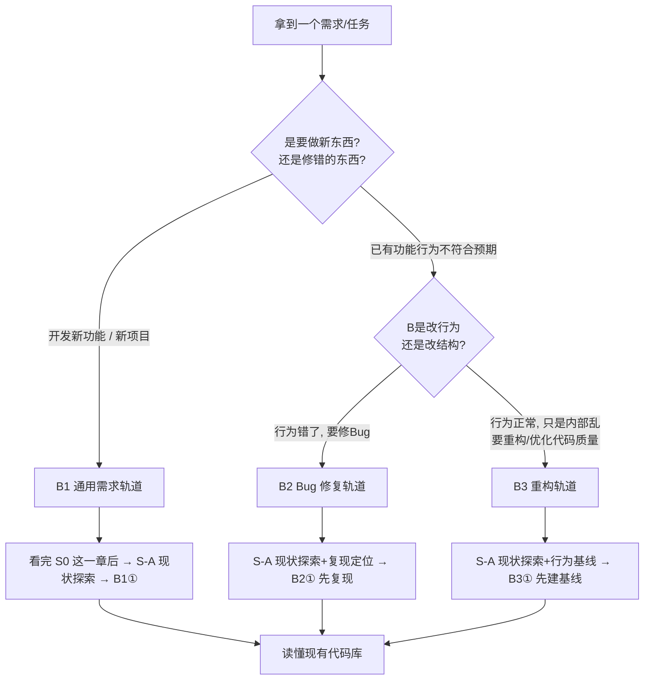

# S0 · 为什么需要流程？—— 三条轨道共同的地基

> **定位**：这是整本教程的起跑线，三条轨道（B1 通用需求 / B2 Bug 修复 / B3 重构）的公共地基。
> **目标**：建立工程化思维，理解「直接让 AI 改代码」到底会付出什么代价，以及一套流程能帮你换回什么。
> **预估时长**：20–40 分钟。

如果你已经习惯了「丢一段话 → AI 出代码 → 我复制粘贴 → 跑一下能用」，那么这一章可能会让你不舒服——因为它要先撕开一个真相：

> **AI 出代码的能力远强于它替你「想清楚需求和边界」的能力。你丢给它的指令有多模糊，它给你的代码就有多不可控。**

流程不是用来束缚你的，恰恰相反——**它是用最小的前期成本，帮你避免最大的后期返工**。下面我们用一个真实感极强的反面案例把这个道理说透。

---

## 一、反面案例：一个模糊需求直接丢给 AI 之后

假设你是一个电商客服系统的开发者。某天下班前，运营同事在群里甩来一句话：

> 「给订单加一个退款按钮，客户点了可以进行退款。」

听起来很简单对吧？你连需求都没问，直接把它原样丢给了 AI：

> 「帮我在订单详情页加一个退款按钮，点击可以退款。」

于是，你踏上了下面这条「看起来在飞快推进、实际上在反复拆东补西」的不归路。

### 1. 第一轮：AI 给了你「你以为想要」的东西

AI 很勤快，5 分钟就给你加了一个 `<button>申请退款</button>`，点击后调了一个退款接口。**你很高兴，觉得 5 分钟交付一个功能，效率惊人。**

但问题在于——**你俩对「退款」的理解可能完全不一样，而你根本没有告诉 AI 差异在哪。** 你现在拿到的是 AI 基于"最通用的退款"想象出来的代码。

### 2. 翻车从这里开始：改东坏西

接着，运营提了一个新要求，这是压垮稻草的开始：

> 「哦对了，部分退款才能退，全款退会把库存回滚逻辑搞坏。」

你让 AI 去改。AI 为了支持「部分退款」，往退款逻辑里塞了一个参数 `isPartial`。**但它并不清楚原来的库存回滚、优惠券退还、支付渠道原路退回这三段逻辑分别该在什么条件下触发。** 于是：

- 部分退款时，库存没回滚——**库存虚高**，客户拍下后发不出货；
- 用了优惠券的订单，全款退款时券没有退还——**用户投诉**；
- 原本好好的「退款后冻结风控标记」，因为 AI 为了兼容新参数顺手改了判断，**变得时灵时不灵**。

你开始让 AI「改坏了的回来」，AI 又改了第三处、第四处……**每一处修改都在它看不见的依赖链条上踩了雷。这就是典型的「改东坏西」。**

### 3. 你无法验证「到底对不对」

更痛苦的是，你**没有一句验收标准**，所以根本没法定性它是否完成。你只能靠肉眼点两下页面：「好像能退款了」。但——

- 输入负数金额呢？改成超订单金额呢？**边界全崩。**
- 并发两笔退款会怎样？**没有测试、没有用例，你根本不敢上线。**

你只能祈祷「别出事」。**一个本可以凭验收标准 + 测试锁住的功能，变成了全凭运气的黑盒。**

### 4. 最后：它成了你不敢维护的债

三个月后，需求又变了。你翻开这段代码——密密麻麻、层层补丁，`refund` 函数里塞了七八个布尔开关，**没人（包括 AI）说得清每个组合的真实行为。** 你不敢删、不敢改、不敢重构，只能继续往上堆补丁。

> **复盘一句话：你缺的从来不是「让 AI 写代码」，而是「在让 AI 写之前，先把需求、边界、验收、影响面想清楚」的能力。**

---

## 二、三种典型的翻车现场：每条轨道各踩一种坑

上面是笼统的案例。但 Vibe Coding 的坑不止一种，**不同需求类型翻车的模式完全不同**。这就是教程拆成 B1 / B2 / B3 三条轨道的原因——每种坑要用的「解药」都不一样。

| 轨道 | 场景 | 典型翻车模式 | 一句话根源 |
|------|------|--------------|------------|
| **B1 通用需求**（新功能/新项目） | 加退款按钮、对接支付、做报表页 | **改东坏西、范围失控** | 需求边界没澄清，方案没设计就裸奔 |
| **B2 Bug 修复** | 线上订单金额算错、页面白屏 | **没复现就瞎猜根因，越修越多** | 把症状当根因，不建回归就开修 |
| **B3 重构** | 把 2000 行的「上帝类」拆掉 | **不动架构只堆补丁，代码更乱** | 不建行为基线，改坏了也察觉不到 |

### 场景一（B1）：新功能——范围失控

你要给客服后台加「导出订单报表」。你丢给 AI：「做个导出功能」。AI 做了 CSV。运营又说要 Excel、要筛选、要按渠道分组、要定时邮件推送……**每加一个，代码就更厚一层，但最初的「导出的列到底有哪些、数据口径是什么」从没定下来。** 结果功能越滚越大，验收遥遥无期——**需求没澄清，范围必然失控。**

### 场景二（B2）：Bug 修复——把症状当根因

线上订单金额偶尔对不上。你没复现，凭感觉丢给 AI：「订单金额好像有问题，帮我看看」。AI 顺着你含糊的描述，找到一个「看起来可疑」的地方改了。第二天**同一个 Bug 换了个触发姿势又出现了**——因为你改的是症状，不是根因。**没先复现、没先写回归测试就去修，是 B2 轨道最重的坑。**

### 场景三（B3）：重构——越改越乱的反面教材

你嫌一个订单处理的 `OrderService` 太大，直接丢给 AI：「帮我重构一下」。AI 大刀阔斧把方法拆分、职责重排——**但是没有任何测试锁住原来的行为。** 重构完，表面「更干净了」，可库存逻辑、优惠券逻辑悄悄变了一点，**线上立刻出问题，你甚至不知道是哪一步改坏的。** 重构不先建「行为基线」，等于在黑暗的房间里挪家具。

> **结论：三条轨道不是三套花架子，而是三种「坑」对应的三副解药。** 接下来的每个章节都会回到这里：当你遇到哪一类问题，就套用哪一条轨道。

---

## 🔴 三、流程到底帮你换回了什么？—— 四大核心价值

被吓到了吧？别慌。流程的价值，恰恰就是上面每一个「翻车点」的镜像。我们可以把流程的价值压缩成四个词：

### 价值一：降低不确定性 —— 从「猜」到「定」

没有流程时，你每一步靠猜：猜需求、猜影响、猜对不对。有流程时，你在动手前就把「要什么、边界在哪、怎么算完成」写下来。

- **没有流程**：AI 猜需求 → 你猜它对不对 → 上线靠烧香。
- **有流程**：需求文档、验收标准先落地 → AI 照着做 → 你照着验。

> 一句话：**流程把「模糊期望」翻译成「可核对的标准」。**

### 价值二：提高可验证性 —— 从「感觉能行」到「证据在手」

流程强制你在关键节点留下「测试 / 验收标准 / 行为基线」这类**可执行、可核对的证据**。

- **没有流程**：「目测能退款」
- **有流程**：「回归测试覆盖了正常退款、部分退款、退款超金额、并发退款，全部通过」

> 一句话：**验证从「凭感觉」变成「凭证据」，从此你上线是有底气的。**

### 价值三：保证质量 —— 从「能用」到「敢于长期维护」

流程里设计、测试、文档每个环节，都会拦住「埋雷式」的临时方案，逼着你在早期把小毛病扼杀，而不是让它发酵成三个月后的技术债。

> 一句话：**流程让你今天写的代码，三个月后自己还敢碰。**

### 价值四：便于协作 —— 从「一个人扛」到「一群人透明」

无论是队友、外包、还是三个月后的你自己，都能通过【需求文档 / 设计文档 / 任务清单 / 测试报告 / 交付清单】快速接手。你不再是代码里唯一的「活文档」。

> 一句话：**流程让项目从"只存在于你脑子里"变成"谁都能看懂、谁都能接手"。**

---

## 🔴 四、怎么选轨道？—— 分支选择地图

流程不是一套，而是三套。上手第一步，是**先判断当前任务属于哪条轨道**。这张分支选择地图帮你在一分钟之内选对。



### 三句话帮你记住怎么选

1. 是**要做新东西**？→ 走 **B1**（最完整，也是参照系，建议最先学）。
2. 是**现有功能坏了**，行为是错的？→ 走 **B2**（核心口诀：**先复现、先写回归，再动手修**）。
3. 是**行为没坏，但代码内部乱**，想让它更好维护？→ 走 **B3**（核心口诀：**先锁行为基线，再小步改**）。

> 💡 一个任务也可能混着来：比如先给新功能加导出（B1），结果发现现有导出有 Bug（B2）。**没关系，按主线 B1 走，遇到 Bug 分支时临时切到 B2 的"先回归后修复"手法，修完再切回来。** 分支地图是导航，不是枷锁。

---

## 🔴 五、一套流程打天下？—— 按复杂度「裁剪」

你可能会问：「我写个 5 行的脚本，也要做需求文档 + 技术设计 + 测试 + 文档交付？太夸张了！」——**完全正确，流程要适合任务的复杂度，而不是反过来。**

核心原则：**越简单，跳过的步骤越多；越复杂、影响越大，越要完整地走一遍。**

### 裁剪原则一览表

| 任务复杂度 | 示例 | 建议裁剪 |
|------------|------|----------|
| **微脚本**（一次性、无副作用、无人共享） | 把某个 CSV 转个格式 | 只需**需求一句话 + 写代码 + 手测一次**；可跳过设计、ADR、测试、文档 |
| **小功能**（有人用、会有后续） | 给内部工具加个导出按钮 | 保留**需求澄清 + 简短设计 + 少量测试**；ADR 用一句话轻量版 |
| **中功能**（跨模块、影响数据） | 订单退款、对接第三方支付 | 基本**全流程**：需求文档 → 技术方案 → 多方案评审 → 任务拆解 → 测试 → 文档 |
| **大系统/新项目**（多人协作、长期维护） | 从零做一个客服系统 | **全流程 + 正式 ADR + CI/CD + 文档进版本控制**，一步不省 |

### 判断用的「复杂度三问」

拿不准时，问自己三句：

1. **影响面多大？** 只影响一个函数 → 可裁剪；影响库存/金额/数据 → 不能省。
2. **有没人依赖？** 只有你自己用一天 → 可裁；别人要长期用 → 别裁。
3. **坏了会怎样？** 坏了重跑一遍就行 → 可裁；坏了出事故、赔钱 → 别裁。

> 💡 安全默认值：**不确定时，宁可多补一条验收标准、多写一个测试，也不要赌它不会出事。** 裁流程是为效率，不该是为偷懒找借口。

> **新手可选 · 5 步最小闭环（先跑通，再规范）**
>
> 如果此刻你还没写过一行 AI 生成的代码，觉得 B1 那套完整流程太重、想先"做出个能跑的东西"建立信心——可以，先走下面这个**最小闭环**。这是一张**加速入场券，不是替代正式流程**：这里跳过的每一步，正是你返工回来补的那一步。
>
> | 步骤 | 极简动作 | 防崩坏机制 |
> | :--- | :--- | :--- |
> | **1. 一句话需求** | 用大白话告诉 AI 你要做什么 | AI 反问太多，就回"请给我 3 个默认选项"（见 B1-① 卡壳救助站） |
> | **2. 三句设计** | 只定三件事：①数据放哪 ②入口在哪 ③坑在哪（幂等/边界） | 跳过架构图，就让 AI 画出这 3 点的小草图 |
> | **3. 先列验收清单（关键）** | 让 AI 先列出你点按钮时"正常 / 异常 / 边界"的验收清单（这是测试用例的前身，不是让你现在就写代码） | **用验收清单当唯一目标**，先不写正式文档 |
> | **4. AI 写代码** | 把验收清单贴给 AI，让它对着清单写 | 只加一句约束："只改我说的文件，别碰其他地方" |
> | **5. 人工验收** | 对着第 3 步的清单逐条点一遍 | 全绿 = 收工，正式文档暂时全跳过 |
>
> **什么时候回来走正式流程？** 当你用最小闭环跑通 2–3 个小功能后，多半会撞上"改东坏西"或"上周写的忘了怎么改了"。**那一刻，请带着这份切肤之痛，回到 S-A 和 B1① 开始走正式版。** 那时你会明白：流程不是束缚，是你为自己定制的"后悔药"。完整原理都在各章里，这里只是先给你一条能跑的通路。

---

## 六、第 0 步：开工前先把装备配齐（纯零基础从这里进）

> ⚠️ **如果你已经有一个能启动的项目、会配 AI 工具、能看懂一眼报错，直接跳过本节**，从第七节练习开始即可。本节只写给"我连一个能跑的都在没有"的你——不是流程难，是你手里的"地图"还没有对准能起步的"脚"。

教程正文默认你有三样东西：**一个能跑的项目、一款配好的 AI 编码工具、一份能看懂一眼的报错**。本节用最小动作把这三样补齐，之后你才能"点一下能看到画面、报错能说清哪行"。

### 最小装备清单（全教程开工前提）

| # | 装备 | 最小验收 = 你亲眼看到 | 还不会？ |
|---|------|----------------------|----------|
| 1 | **AI 编码工具**（Cursor / Trae / 装 AI 插件的 VS Code 等） | 在编辑器里选中代码，能呼出 AI 面板并得到回复 | 装官方推荐即可，"能用"就够，不追求高阶配置 |
| 2 | **一个能跑的最小项目** | `npm run dev` / `python manage.py runserver` 之类命令后，浏览器能打开页面 | 新手直接用官方脚手架（如 `create-xxx-app`）生成，别手搭 |
| 3 | **最小 git** | `git init`、`git add`、`git commit` 各敲一次能成功 | 先记住这三条就够，S-C 再深入 |
| 4 | **能看懂第一次报错** | 运行报红时，能从日志里划出"哪一行错了"那句 | 对着下一节"报错怎么看"划一遍 |

### 报错最小读法（第一次见到满屏报错别慌）

1. **找 `Error` / `Exception` 后面那一段**，那是"发生了什么"。
2. **往上找 `at …` / `File "…", line N`**，那是"发生在哪个文件哪一行"——红色背景或波浪线的行优先。
3. **只看这两样就够**，其余堆栈多半是框架内部噪音。用它去问 AI，别整屏贴过去。

> 💡 这三样配齐后，后面 B1①⑤ / S-B 里的"打开页面点一遍""存进 docs 目录""跑测试"才有对象可操作——**这节不是额外负担，是让后面每句"动手"都不落空的地基**。想更省事，回到前面"5 步最小闭环"，先拿最小项目跑通一个小需求。

> 📚 **读不懂术语别硬扛**：正文里撞到"幂等 / 状态机"这类词看不明白，直接翻 **S-附录 顶部的 🧭 新手术语速查**，每个词都有一句大白话 + 在哪儿遇到，比硬猜省事。

---

## 七、练习：回忆一次你的翻车

现在，把镜头转向你自己。

**任务**：回忆一次你「直接把需求丢给 AI / 直接上手改代码」最终翻车的经历，然后用下面的模板做一次复盘。

### 练习模板

```text
一句话描述当时的任务：
当时我是怎么做的（丢需求 / 直接改代码）：
最终翻车了吗？具体翻在哪（改东坏西 / 无法验证 / 越修越多 / 前任代码不敢碰）：
这件事最像哪条轨道（B1 新功能 / B2 Bug / B3 重构）：
当时缺了哪个阶段（需求澄清 / 设计 / 复现 / 回归测试 / 行为基线 / 文档）：
如果重来一次，我会在动手前多补哪 2 件事：
```

**示例（供参考）**：

> - 一句话描述：给客服后台的订单加退款入口，直接让 AI 改。
> - 当时怎么做的：丢了一句「加个退款按钮」给 AI。
> - 翻车在哪：加了参数后，库存没回滚 + 优惠券没退还，改来改去越改越乱。
> - 最像哪条轨道：**B1 通用需求**。
> - 缺了哪个阶段：**需求澄清**（没问清部分退款 / 全款退款的规则）和**技术方案**（没梳理库存、券、支付的回滚依赖）。
> - 重来会补的两件事：① 先写一份含验收标准的简版需求文档；② 动手前让 AI 画一遍相关代码的依赖链条（S-A 的代码库地图）。

**做完这个练习，你就已经把 S0 的价值内化了一大半。** 之后无论走哪条轨道，你都会带着「先想清楚再动手」的肌肉记忆出发。

---

## 八、本章验收清单

学完 S0，请核对下面每一项，**确认你能不看笔记脱口而出**：

- [ ] 我能说清「直接把模糊需求丢给 AI」最常见的三种后果（改东坏西 / 无法验证 / 难以维护）。
- [ ] 我能分别说出 B1 / B2 / B3 三条轨道各自的典型翻车模式。
- [ ] 我能背出流程的四大价值，并各举一个具体场景把它讲给同事听。
- [ ] 我拿到一个任务时，能按「做新东西 / 行为错 / 结构乱」判断出该走哪条轨道。
- [ ] 我能用「影响面 / 依赖者 / 坏了后果」三问，判断一个任务该完整走流程还是可以裁剪。
- [ ] 我已完成「六、练习」的复盘，识别出自己上一次翻车对应的轨道与缺失阶段。
- [ ] 我能判断一个需求该走哪条轨道、该裁剪哪些步骤（而非所有任务都套同一套流程）。

> ✅ 有一条做不到？回看对应小节。全部做到，就可以进入 **S-A 现状探索**，或者直接跳到你选定轨道的第一步：
> - B1 通用需求 → `B1-① 需求澄清与分析`
> - B2 Bug 修复 → `B2-① 复现与界定 Bug`
> - B3 重构 → `B3-① 建立行为基线`